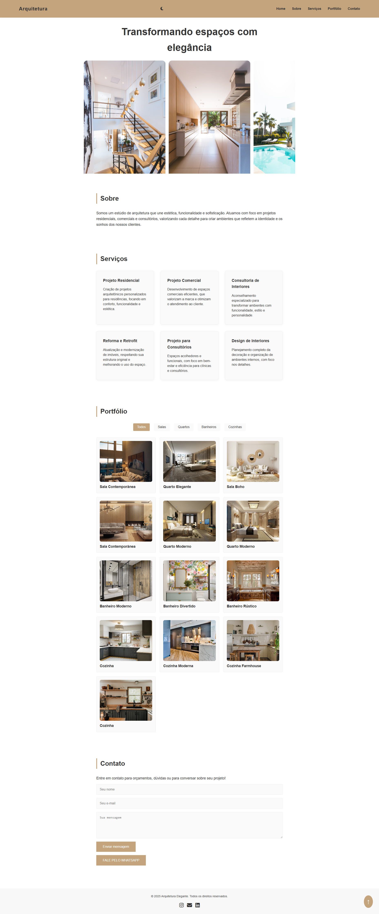
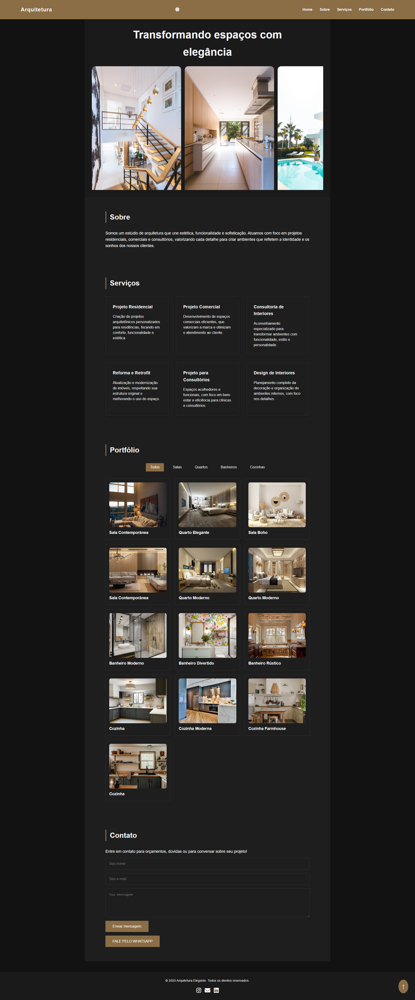

# Site de Arquitetura 

Este é um site institucional desenvolvido para um escritório de arquitetura fictícia. O objetivo do projeto é apresentar os serviços, portfólio de projetos e facilitar o contato com potenciais clientes, tudo em um layout moderno, responsivo e elegante.

 

## Funcionalidades

- Página inicial com slogan e galeria de imagens dos projetos
- Seção "Sobre" com informações sobre o escritório
- Galeria com imagens organizadas e responsivas
- Seção de serviços prestados
- Formulário de contato funcional com link direto para WhatsApp
- Ícones sociais (Instagram, LinkedIn, E-mail)
- Botão de "voltar ao topo" fixo no canto da tela
- Animações de entrada suaves com a biblioteca [AOS](https://michalsnik.github.io/aos/)

##  Tecnologias utilizadas

- **HTML5**
- **CSS3**
- **JavaScript**
- **Font Awesome** (ícones)
- **AOS - Animate on Scroll Library**

##  Layout Responsivo

O site foi projetado com foco na boa experiência de navegação em celulares, tablets e desktops.  
⚠️ **Observação:** o layout ainda está em fase de ajustes para responsividade total. Algumas seções precisam de adaptações para garantir melhor visualização em diferentes tamanhos de tela.  
Atualizações serão feitas nas próximas versões do projeto.

 

Desenvolvido com 💙 por Cláudia Costa Paniago
